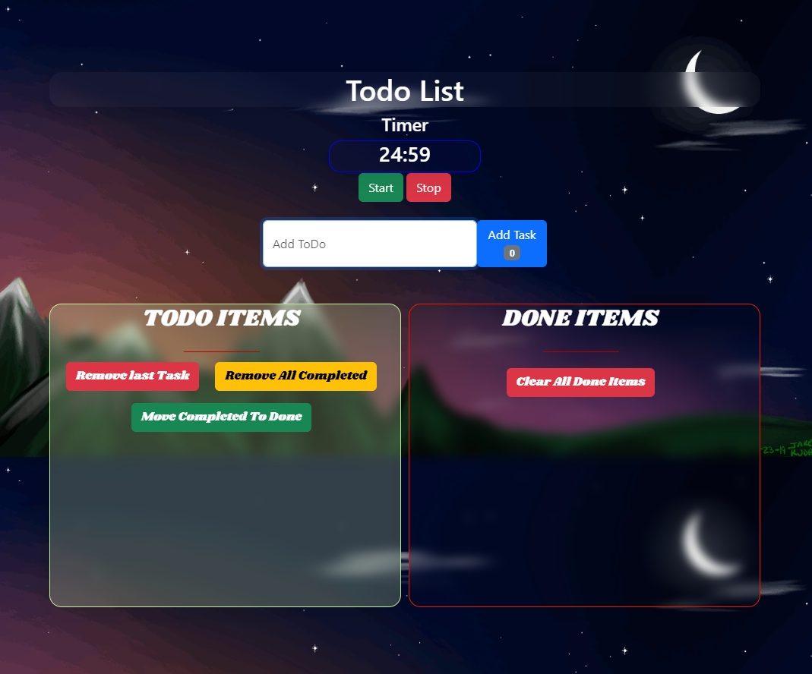

# ToDo App
Overview
This is a simple and efficient To-Do List application built with HTML, CSS, and JavaScript. It allows users to manage their tasks effectively by adding, viewing, and marking tasks as done. Additionally, it features a timer to help users stay focused and manage their time efficiently.

## Features
Add To-Do Items: Easily add new tasks to your to-do list.
View Done Items: Keep track of tasks that have been completed.
Timer: Utilize a built-in timer to manage your task time effectively.
Responsive Design: Accessible and user-friendly on all devices.

## Technologies Used
- **HTML**: For the structure of the application.
- **CSS**: For styling the application.
- **JavaScript**: For the functionality and interactivity of the application.

## Installation

Clone the repository:
```bash
git clone https://github.com/AchmetCh/TodoApp.git
```
Navigate to the project directory:
```bash
cd TodoApp
```
Open index.html in your web browser to run the application.

## Usage
- Adding Tasks: Enter a task in the input field and click the "Add" button.
- Marking Tasks as Done: Click the checkbox next to a task to mark it as completed.
- Viewing Done Tasks: Completed tasks are moved to the "Done" section.
- Using the Timer: Set the desired time and start the timer to manage your task duration.

## Contributing
Contributions are welcome! If you have any suggestions, bug reports, or improvements, feel free to fork the repository and submit a pull request.

## License
This project is licensed under the MIT License. You are free to use, modify, and distribute this software as you see fit.

Everyone is encouraged to fork this project and make it even better!

## Contact
If you have any questions or feedback, please contact me at gigsakos@gmail.com.

Thank you for using the To-Do List application! Happy task managing!